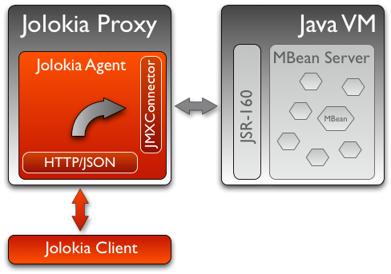

////
  Copyright 2009-2023 Roland Huss

  Licensed under the Apache License, Version 2.0 (the "License");
  you may not use this file except in compliance with the License.
  You may obtain a copy of the License at

        https://www.apache.org/licenses/LICENSE-2.0

  Unless required by applicable law or agreed to in writing, software
  distributed under the License is distributed on an "AS IS" BASIS,
  WITHOUT WARRANTIES OR CONDITIONS OF ANY KIND, either express or implied.
  See the License for the specific language governing permissions and
  limitations under the License.
////

== JMX Proxy

image:../images/features/proxy_large.png["JMX Proxy",role=right]
There are situations, where a deployment of an Jolokia agent
on the target platform is not possible. This might be for
political reasons or an already established JSR-160 export on
the instrumented servers. In these environments, Jolokia can
operate as a *JMX Proxy*. In this setup, the
agent is deployed on a dedicated proxy Jakarta EE server (or other
supported agent platform). The proxy bridges between Jolokia
JSON request and responses to remote JSR-160 calls to the
target server. The following diagrams gives an illustration of
this setup.

A Jolokia proxy is universal and agnostic to the target server
as it gets its information for the target via an incoming
request (the same as for an HTTP proxy). Due to this required
extended information, only Jolokia POST requests can be used
for proxying since there is currently no way to encapsulate
the target information within a GET URL. The base Jolokia URL
for the request is that of the proxy server, whereas the
target parameters are included in the request.

=== JMX Remote primer

The standard (but often forgotten) _remoting_ technology for Java applications is RMI.

In order to access a `javax.management.MBeanServer` available withing a remote JVM, we should actually
access a _remote view_ of this interface. It is possible using https://docs.oracle.com/en/java/javase/11/management/monitoring-and-management-using-jmx-technology.html#GUID-F08985BB-629A-4FBF-A0CB-8762DF7590E0[Remote Monitoring and Management,role=externalLink].

The connection is established between two entities specified in "Chapter 13, Connectors" of the unified JMX specification (combined JSR-3 and JSR-160):

* _connector server_ - it is attached to target `javax.management.MBeanServer` within the same JVM and listens for incoming messages using some kind of protocol.
* _connector client_ - it is used to find and connect to running _connector server_

JMX specification defines two protocols to be used between _connector client_ and _connector server_:

* `jmxrmi` - a protocol based on RMI (mandatory protocol for JMX implementations), uses JMX URIs in the form of `service:jmx:rmi://...`
* `jmxmp` - a protocol based directly on TCP sockets (optional protocol), uses JMX URIs in the form of `service:jmx:jmxmp://...`

Java method to create and start _connector server_ is `javax.management.remote.JMXConnectorServerFactory.newJMXConnectorServer()` and there's only one standard implementation - `javax.management.remote.rmi.RMIConnectorServer` which supports RMI protocol and `service:jmx:rmi://...` JMX URIs

For RMI protocol, these JMX URIs are supported when creating a _connector server_:

* `service:jmx:rmi://host:port` or `service:jmx:rmi://host:port/` - after starting the _connector server_, a `java.rmi.Remote` object representing this server will be Base64 encoded and client will be able to access such server using `service:jmx:rmi://host:port/stub/<base64 encoded javax.management.remote.rmi.RMIServer stub>`
* `service:jmx:rmi://host:port/jndi/<path>` - after starting the _connector server_, its RMI stub will be bound in JNDI registry under `<path>` name. The `<path>` is usually complex name in the form of `rmi://rmi-registry-host:port/name`

Knowing the above, the typical JMX URI of the remote MBean Server is:
----
service:jmx:rmi:///jndi/rmi://localhost:1099/jmxrmi
----

NOTE: `jmxrmi` is a name explicitly used by `sun.management.jmxremote.ConnectorBootstrap.exportMBeanServer()` and the first `host:port` part are omitted becase we only care about the RMI registry where `javax.management.remote.rmi.RMIServer` is bound.

With this technology, what JVM actually _exposes_ as a remote view of `javax.management.remote.rmi.RMIServer` interface which can be used to obtain `javax.management.remote.rmi.RMIConnection` interface which finally can be used to get/set MBean attributes, call MBean operations, etc.

=== Proxy connection to Remote JMX server

In the next
example, a proxied Jolokia request queries the number of
active threads for a Tomcat server via a proxy
`jolokia-proxy`, which has an agent deployed under
the context `jolokia`. The agent URL then is
something like

----
http://jolokia-proxy:8080/jolokia
----

and the POST payload of the request is

[source,json]
----
[
  {
    "type": "read",
    "mbean": "Catalina:type=Server",
    "attribute": "serverInfo",
    "target": {
      "url": "service:jmx:rmi:///jndi/rmi://localhost:1099/jmxrmi",
      "password":"admin",
      "user":"s!cr!t"
    }
  },
  {
    "type": "read",
    "mbean": "java.lang:type=Threading",
    "attribute": "ThreadCount",
    "target": {
      "url": "service:jmx:rmi:///jndi/rmi://localhost:1099/jmxrmi",
      "password":"admin",
      "user":"s!cr!t"
    }
  }
]
----

The target is part of the request and can contain
authentication information as well (with params
`user` and `password`)

The result may look like:
[source,json]
----
[
  {
    "request": {
      "mbean": "Catalina:type=Server",
      "options": {
        "targetId": "service:jmx:rmi:///jndi/rmi://localhost:1099/jmxrmi",
        "target": {
          "url": "service:jmx:rmi:///jndi/rmi://localhost:1099/jmxrmi",
          "password":"admin",
          "user":"s!cr!t"
        }
      },
      "attribute": "serverInfo",
      "type": "read"
    },
    "value": "Apache Tomcat/10.1.16",
    "status": 200,
    "timestamp": 1701952860
  },
  {
    "request": {
      "mbean": "java.lang:type=Threading",
      "options": {
        "targetId": "service:jmx:rmi:///jndi/rmi://localhost:1099/jmxrmi",
        "target": {
          "url": "service:jmx:rmi:///jndi/rmi://localhost:1099/jmxrmi",
          "password":"admin",
          "user":"s!cr!t"
        }
      },
      "attribute": "ThreadCount",
      "type": "read"
    },
    "value": 36,
    "status": 200,
    "timestamp": 1701952860
  }
]
----

=== Limitations

Operating Jolokia as a JMX proxy has some limitations
compared to a native agent deployment:

* xref:bulk-requests.adoc[Bulk requests] are
possible but not as efficient as for direct operation. The
reason is, that JSR-160 remoting doesn't know about bulk
requests, so that a Jolokia bulk request arriving at the
proxy gets dispatched into multiple JSR-160 requests for the
target. The JSR-160 remote connection has to be
established only once, though.
* The JMX target URL addresses the MBeanServer directly, so
MBeanServer merging as it happens for direct operation is
not available. Also, certain workarounds for bugs in the
server's JMX implementation are not available.
* When not standard Java types are returned by JMX operations
or attribute read calls, these types must be available on
the proxy, too. Using the Jolokia agent directly, complex
data types are serialized deeply into a JSON
representation automatically.
* For each Jolokia request, a new JMX connection (likely
using RMI) is created which is an expensive operation. A
future version of Jolokia will tackle this by providing
some sort of optional JSR-160 connection pooling.

=== Next

* See why how Jolokia can xref:security.adoc[secure] JMX access in a very fine granular way.
* Learn something about xref:bulk-requests.adoc[bulk JMX requests].
* Go Back to the xref:../features.adoc[Features Overview].
