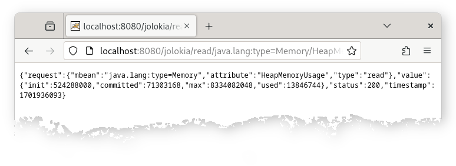

////
  Copyright 2009-2023 Roland Huss

  Licensed under the Apache License, Version 2.0 (the "License");
  you may not use this file except in compliance with the License.
  You may obtain a copy of the License at

        https://www.apache.org/licenses/LICENSE-2.0

  Unless required by applicable law or agreed to in writing, software
  distributed under the License is distributed on an "AS IS" BASIS,
  WITHOUT WARRANTIES OR CONDITIONS OF ANY KIND, either express or implied.
  See the License for the specific language governing permissions and
  limitations under the License.
////

== Simple

image:../images/features/simple_large.png["Simple",role=right]
For Jolokia to work, an agent must be deployed, the one way or
the other. But this is a common business:

* The link:../agent/war.html[WAR Agent] gets deployed as any other
Jakarta EE web application. Often this is as simple as
copy of the agent WAR into a certain directory
(like `webapps/` for Tomcat). Or it gets deployed via an administrative
user interface (web GUI or command line tool). In any case,
the procedure should be familar to any Java developer or
administrator dealing with Jakarta EE applications.
* The link:../agent/osgi.html[OSGi Agent] gets deployed as any other
OSGi bundle, which is also a well known procedure (although
specific to each OSGi container). For the pure bundle, there
is a requirement for an OSGi runtime to include https://docs.osgi.org/specification/osgi.cmpn/8.1.0/service.servlet.html[Whiteboard Specification for Jakarta™ Servlet] implementation.
* The link:../agent/jvm.html[JVM JDK 11 Agent] requires for its setup
some extra command line parameter for the JVM, but this
shouldn't be a big deal either.

On the other hand, setting up JSR-160 connectors is not
that easy as it might appear. There are various kind of
issues like problems when using different JDK versions on
client and server side or exposing the
`PlatformMBeanServer`.

Once the agent has been installed, using Jolokia on the client
side is easy. Since the protocol relies on a standard protocol (HTTP)
and format (JSON), it is easy for non-Java systems to access
MBeans. It can be even accessed from within the browser with a
simple URL. Although this is still a bit cryptic, it is a good
test to check the installation of Jolokia.

Assuming that the agent is reachable under
``\http://localhost:8080/jolokia``, memory usage can
be checked with the browser using http://localhost:8080/jolokia/read/java.lang:type=Memory/HeapMemoryUsage URL:

The actual value is contained in the returned JSON
representation under the key `value`. In this
example, a so called _path_ (i.e. `used`)
is appended to the URL which allows for deep access in more
complex Java types (`javax.management.openmbean.CompositeData` in this
case).

Try:

* http://localhost:8080/jolokia/read/java.lang:type=Memory
* http://localhost:8080/jolokia/read/java.lang:type=Memory/HeapMemoryUsage
* http://localhost:8080/jolokia/read/java.lang:type=Memory/HeapMemoryUsage/used

=== Next

* See why Jolokia plays nicely with your link:firewall.html[firewall].
* Jolokia is really link:fast.html[fast]. See why.
* Go Back to the link:../features.html[Features Overview].
