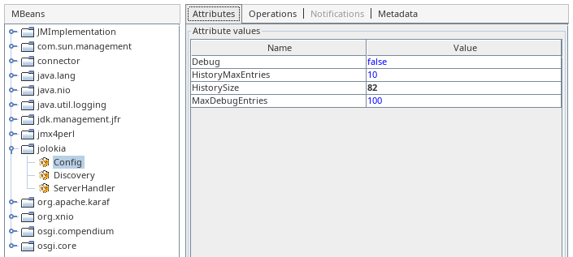
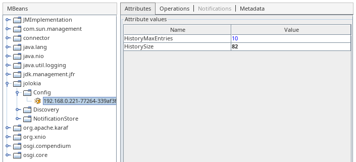

////
  Copyright 2009-2023 Roland Huss

  Licensed under the Apache License, Version 2.0 (the "License");
  you may not use this file except in compliance with the License.
  You may obtain a copy of the License at

        http://www.apache.org/licenses/LICENSE-2.0

  Unless required by applicable law or agreed to in writing, software
  distributed under the License is distributed on an "AS IS" BASIS,
  WITHOUT WARRANTIES OR CONDITIONS OF ANY KIND, either express or implied.
  See the License for the specific language governing permissions and
  limitations under the License.
////

== Migration to 2.x

Jolokia 2.0 should be fully backward-compatible with versions 1.x at protocol level. This means that old `jolokia.js` library should work with Jolokia 2 as well.

This is true also from Jolokia Java client perspective and processing of JSON messages sent over HTTP.

However there are other aspects that need to be considered when moving from Jolokia 1 to Jolokia 2.

=== Servlet API compatibility

`org.jolokia.server.core.http.AgentServlet` which is part of `org.jolokia:jolokia-server-core` library is now implementing Servlet API 5 from Jakarta EE 9 specification. In fact it should be compatible with any newer Jakarta EE specification (e.g., 10) and Servlet API (e.g., 6).

This concerns also the derived `org.jolokia.server.core.osgi.OsgiAgentServlet` from `org.jolokia:jolokia-agent-osgi` which now works with new https://docs.osgi.org/specification/osgi.cmpn/8.1.0/service.servlet.html[OSGi CMPN Whiteboard Specification for Jakarta™ Servlet,role=externalLink] based on Jakarta EE 9+. This means that Jolokia 2.0 OSGi bundle won't work with Karaf 4.4 which uses Jakarta EE specification based on `javax` packages.

https://github.com/apache/felix-dev/tree/master/http[Felix HTTP,role=externalLink] has PoC module based on Jetty 12 that implements two Servlet APIs (`javax` and `jakarta`) and at [current state] it should support Jolokia 2.

In https://github.com/ops4j/org.ops4j.pax.web[Pax Web,role=externalLink] there's work pending on Pax Web 10 which also should support old and new Servlet API packages.

Moving to JakartaEE 9+ impacted Jolokia's WAR agents - these use `\https://jakarta.ee/xml/ns/jakartaee` namespace in `WEB-INF/web.xml` and should work in these web application servers:

* https://eclipse.dev/jetty/download.php[Jetty 11 and newer,role=externalLink]
* https://tomcat.apache.org/download-10.cgi[Tomcat 10 and newer,role=externalLink]
* https://github.com/undertow-io/undertow/[Undertow 2.3 and newer,role=externalLink]

Of course all JakartaEE 9+ compliant servers are supported.

=== Javascript support

Jolokia 1.x includes `org.jolokia:jolokia-client-javascript` Maven module, which packages `jolokia.js`, `jolokia-simple.js` and other libraries.

In Jolokia 2, the same Maven module can be used in your Java application, but additionally, official https://www.npmjs.com/package/jolokia.js[NPM package,role=externalLink] is available. You can install it with `npm i jolokia.js` or `yarn add jolokia.js`.

There are https://www.npmjs.com/search?q=jolokia[several other Jolokia NPM packages available,role=externalLink], so mind that `jolokia.js` is the official one.

The minimum supported JavaScript version is now ES5. For environments with ES3 and older JavaScript versions, keep using old versions of the JavaScript client provided with Jolokia 1.x.

Since it is based on ES5, `JSON2.js` is no longer required. You can also use it with a TypeScript project, as the client provides its type definitions with the package.

=== Reorganized modules

Jolokia 2 modules are organized into extensible core module and pluggable services. More information can be found on xref:libraries.adoc[Libraries page].

Because important Jolokia functionality has been split across _server_ and _service_ modules, at least 3 modules are now needed to provide the same functionality which was provided by single `org.jolokia:jolokia-core` library from Jolokia 1.

These required modules are:

* `org.jolokia:jolokia-server-core` provides request processing framework, extensible request handling, configuration classes and `AgentServlet` (among others)
* `org.jolokia:jolokia-service-serializer` provides Java to JSON serialization services
* `org.jolokia:jolokia-service-jmx` provides _local request handler_ and JMX command handlers (read, exec, search, ...) to handle JMX operation on locally reachable MBeans and MBeanServers

==== Jolokia JVM Agent module

In order to have _one size fits all_ solution, it's enough to include one Jolokia dependency in your Maven project and Servlet API library of your choice (`jolokia-server-core` has a dependency on `jakarta.servlet:jakarta-servlet-api` in `provided` scope)

[source,xml,subs="attributes,verbatim"]
----
<dependency>
    <groupId>org.jolokia</groupId>
    <artifactId>jolokia-agent-jvm</artifactId>
    <version>{jolokia-version}</version>
</dependency>
----

This brings in the following dependencies to your project:

[subs="attributes,verbatim"]
----
+- org.jolokia:jolokia-agent-jvm:jar:{jolokia-version}:compile
|  +- org.jolokia:jolokia-server-core:jar:{jolokia-version}:compile
|  +- org.jolokia:jolokia-server-detector:jar:{jolokia-version}:compile
|  +- org.jolokia:jolokia-service-serializer:jar:{jolokia-version}:compile
|  +- org.jolokia:jolokia-service-jmx:jar:{jolokia-version}:compile
|  +- org.jolokia:jolokia-service-discovery:jar:{jolokia-version}:compile
|  +- org.jolokia:jolokia-service-history:jar:{jolokia-version}:compile
|  +- org.jolokia:jolokia-service-jsr160:jar:{jolokia-version}:compile
|  +- org.jolokia:jolokia-service-notif-pull:jar:{jolokia-version}:compile
|  +- org.jolokia:jolokia-service-notif-sse:jar:{jolokia-version}:compile
|  \- com.googlecode.json-simple:json-simple:jar:1.1.1:compile
+- org.jolokia:jolokia-support-jmx:jar:{jolokia-version}:compile
----

Using `org.jolokia:jolokia-agent-jvm` dependency is a safe bet, as all required libraries (except Servlet API, which is in `provided` scope, so should be also _provided_ by you) are brought in.

There's also a second _flavor_ of `org.jolokia:jolokia-agent-jvm` with `javaagent` classifier (which is downloaded as `jolokia-agent-jvm-{jolokia-version}-javaagent.jar` file) that shouldn't be used as _normal_ Maven dependency. Instead this version enbeds its dependencies and provides shaded (with `maven-shade-plugin`) version of `com.googlecode.json-simple:json-simple` library. This version of JVM Agent is to be used specifically outside of Maven project - in container images or standalone applications using `-javaagent:/path/to/agent.jar` JVM argument.

=== Removed modules

* `jolokia-roo:jolokia-roo` for https://spring.io/projects/spring-roo[Spring Roo,role=externalLink] is no longer available. Spring Roo was kind of experiment before highly successful https://spring.io/projects/spring-boot[Spring Boot,role=externalLink].
* `org.jolokia:jolokia-osgi-bundle` (with embedded https://github.com/apache/felix-dev/tree/master/http[Felix HTTP,role=externalLink]) is no longer available. Normal `org.jolokia:jolokia-agent-osgi` should be used with OSGi runtime supporting https://docs.osgi.org/specification/osgi.cmpn/8.1.0/service.servlet.html[OSGi CMPN Whiteboard Specification for Jakarta™ Servlet,role=externalLink]
* `org.jolokia:jolokia-mule` agent is no longer available, but because Jolokia 2 (and 1) simply provides servlet implementation, it can be used in any environment hosting a servlet container

=== Changed modules

* `org.jolokia:jolokia-spring` library (`org.jolokia:jolokia-support-spring` in Jolokia 2) is no longer including `META-INF/spring/jolokia.xml` resource ready to be used with your Spring Framework XML DSL (using `<import resource="classpath:META-INF/spring/jolokia.xml" />`). There are other options for Spring Framework and Spring Boot integration presented in reference manual.

=== Configuration option changes

* `listenForHttpService` option is now deprecated and `registerWhiteboardServlet` should be used instead in OSGi environments. The reason is that Jolokia 2 switched from https://docs.osgi.org/specification/osgi.cmpn/7.0.0/service.http.html[OSGi CMPN Http Service,role=externalLink] to https://docs.osgi.org/specification/osgi.cmpn/8.1.0/service.servlet.html[OSGi CMPN Whiteboard Specification for Jakarta™ Servlet,role=externalLink].
* `dispatcherClasses` option is removed. In Jolokia 1.x it was used to add `org.jolokia.service.jsr160.Jsr160RequestHandler` to a list of available request handlers. In Jolokia 2, this class is dicovered using new service extension model of Jolokia, when `jolokia-service-jsr160` is available on the CLASSPATH (or in `WEB-INF/lib` of the WAR, which is the case for `jolokia-agent-war`).
* Jolokia checks some configuration values also from system properties and environment variables. For example `discoveryAgentUrl` option can be specified as `jolokia.discoveryAgentUrl` system property or `JOLOKIA_DISCOVERY_AGENT_URL` environment variable. However some options had different format of related system property. In Jolokia 1.x, `jsr160ProxyAllowedTargets` could be specified as `org.jolokia.jsr160ProxyAllowedTargets` system property. Now all system properties have `jolokia.` prefix only.
* `allowDnsReverseLookup` option defaults to `false` in Jolokia 2.
* `includeStackTrace` option defaults to `false` in Jolokia 2.

=== Jolokia MBean changes

Jolokia 1 registers `jolokia:type=Config` which combines _history_ and _debug_ attributes and operations:

Jolokia 2 registers `jolokia:type=Config` with just _debug_ attributes and operations, while _history_ part is contained in separate `jolokia:type=History` MBean.

Also `agent=<agentId>` key is added to all Jolokia MBean names.

