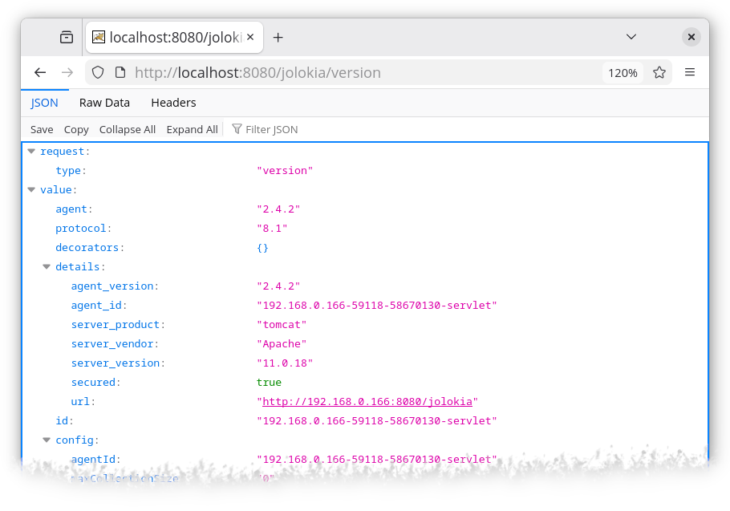
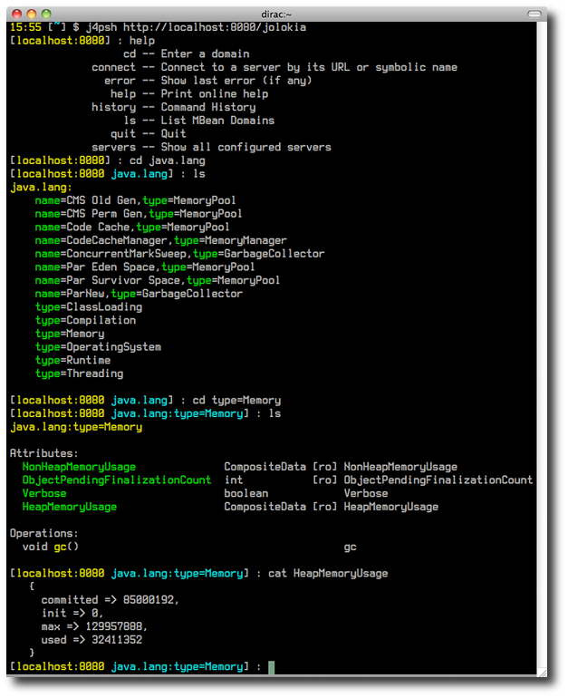

////
  Copyright 2009-2023 Roland Huss

  Licensed under the Apache License, Version 2.0 (the "License");
  you may not use this file except in compliance with the License.
  You may obtain a copy of the License at

        https://www.apache.org/licenses/LICENSE-2.0

  Unless required by applicable law or agreed to in writing, software
  distributed under the License is distributed on an "AS IS" BASIS,
  WITHOUT WARRANTIES OR CONDITIONS OF ANY KIND, either express or implied.
  See the License for the specific language governing permissions and
  limitations under the License.
////

== 5 Minute Quickstart

In this tutorial, it will be demonstrated how easily a WAR agent
can be installed on a fresh Tomcat, how to verify the
installation and how to access the client.

=== Preparation

In order to start on a green field, we are installing a
fresh Tomcat in which the agent-war is going to be
installed. Download Tomcat 10 from its
https://tomcat.apache.org/download-10.cgi[site,role=externalLink] and
extract it:

[source,bash]
----
$ unzip apache-tomcat-10.1.16.zip
$ cd apache-tomcat-10.1.16/
$ TC=$(pwd)
----

Download the Jolokia WAR-agent and copy it into Tomcat's
`webapps/` directory:

[source,bash,subs="attributes,verbatim"]
----
$ artifact=jolokia-agent-war
$ version={jolokia-version}
$ wget https://repo1.maven.org/maven2/org/jolokia/$artifact/$version/$artifact-$version.war \
-O $TC/webapps/jolokia.war
----

If `jolokia-agent-war-unsecured-{jolokia-version}.war` was used, it's be everything, but for standard WAR Agent we have to ensure that Tomcat has a user with `jolokia` role is configured in security realm.

Just add:
[source,xml]
----
<user username="jolokia" password="jolokia" roles="jolokia"/>
----

to `${TC}/conf/tomcat-users.xml`.

=== Startup and Verification

Now the container can be started with:

[source,bash]
----
$ $TC/bin/catalina.sh start
----

In order to verify the installation, point your browser to http://localhost:8080/jolokia/version[] which should show (after authenticating using `jolokia/jolokia` credentials) something like:

We can also access the agent using `curl` command:

[source,bash]
----
$ curl -u jolokia:jolokia -i http://localhost:8080/jolokia/read/java.lang:type=Runtime/Name
HTTP/1.1 200
Cache-Control: no-cache
Pragma: no-cache
Date: Mon, 04 Dec 2023 11:02:59 GMT
Expires: Mon, 04 Dec 2023 10:02:59 GMT
Content-Type: text/plain;charset=utf-8
Transfer-Encoding: chunked

{"request":{"mbean":"java.lang:type=Runtime","attribute":"Name","type":"read"},
    "value":"78033@everfree.forest","status":200,"timestamp":1701687779}
----

=== A simple Java Client

Let's try out the client side of Jolokia. This example will
print out the memory usage of your Tomcat server:

[source,java]
----
import java.util.Map;

import org.jolokia.client.J4pClient;
import org.jolokia.client.request.J4pReadRequest;
import org.jolokia.client.request.J4pReadResponse;

public class JolokiaDemo {

    public static void main(String[] args) throws Exception {
        J4pClient j4pClient = J4pClient.url("http://localhost:8080/jolokia")
                .user("jolokia")
                .password("jolokia")
                .build();
        J4pReadRequest req = new J4pReadRequest("java.lang:type=Memory", "HeapMemoryUsage");
        J4pReadResponse resp = j4pClient.execute(req);
        Map<String, Long> vals = resp.getValue();
        long used = vals.get("used");
        long max = vals.get("max");
        int usage = (int) (used * 100 / max);
        System.out.println("Memory usage: used: " + used + " / max: " + max + " = " + usage + "%");
    }

}
----

Save this code-snippet under `JolokiaDemo.java`. Then download

* https://repo1.maven.org/maven2/org/jolokia/jolokia-client-java/{jolokia-version}/jolokia-client-java-{jolokia-version}.jar[jolokia-client-java-{jolokia-version},role=externalLink]
* https://repo1.maven.org/maven2/org/apache/httpcomponents/httpclient/4.5.14/httpclient-4.5.14.jar[httpclient-4.5.14.jar,role=externalLink]
* https://repo1.maven.org/maven2/org/apache/httpcomponents/httpcore/4.4.16/httpcore-4.4.16.jar[httpcore-4.4.16.jar,role=externalLink]
* https://repo1.maven.org/maven2/com/googlecode/json-simple/json-simple/1.1.1/json-simple-1.1.1.jar[json-simple-1.1.1.jar,role=externalLink]
* https://repo1.maven.org/maven2/commons-logging/commons-logging/1.2/commons-logging-1.2.jar[commons-logging-1.2.jar,role=externalLink]
* https://repo1.maven.org/maven2/commons-codec/commons-codec/1.16.0/commons-codec-1.16.0.jar[commons-codec-1.16.0.jar,role=externalLink]

and put these libraries into the same directory as this demo class. Finally, compile the demo and let it run:

[source,bash,subs="attributes,verbatim"]
----
$ export CLASSPATH=.:\
jolokia-client-java-{jolokia-version}.jar:\
httpclient-4.5.14.jar:\
httpcore-4.4.16.jar:\
json-simple-1.1.1.jar:\
commons-logging-1.2.jar:\
commons-codec-1.16.0.jar

$ javac JolokiaDemo.java

$ java JolokiaDemo
Memory usage: used: 53792744 / max: 8334082048 = 0%
----

If you are using Maven, it is enough to include single dependency:
[,xml,subs="attributes,verbatim"]
----
<dependency>
    <groupId>org.jolokia</groupId>
    <artifactId>jolokia-client-java</artifactId>
    <version>{jolokia-version}</version>
</dependency>
----

Remaining dependencies are available transitively:

[,subs="attributes,verbatim"]
----
+- org.jolokia:jolokia-client-java:jar:{jolokia-version}:compile
   +- com.googlecode.json-simple:json-simple:jar:1.1.1:compile
   +- org.apache.httpcomponents:httpcore:jar:4.4.16:compile
   +- org.apache.httpcomponents:httpclient:jar:4.5.14:compile
   |  \- commons-logging:commons-logging:jar:1.2:compile
   \- commons-codec:commons-codec:jar:1.16.0:compile
----

=== Install Jmx4Perl

NOTE: This section is a tribute to link:about.html[Perl origins of Jolokia].

The five minutes are probably over now, but I highly
recommend to install
https://metacpan.org/dist/jmx4perl[jmx4perl,role=externalLink] right
now. Beside providing a Perl language binding for Jolokia,
there are some cool command line tools included which are
useful on their own.

* *jmx4perl* is a command for exploring the
JMX space by providing arguments on the command line.
* *j4psh* is a readline based, colored,
interactive shell with context sensitive command
completion on MBean names and attributes/operations. It
is a perfect tool for interactively exploring MBeans and
their values.
* *check_jmx4perl* is a feature reach Nagios
plugin for connecting the Jolokia agent with Nagios.
* *jolokia* is a supporting script for easy
download and configuration of the Jolokia agents.

`jmx4perl` (and its dependencies) can be easily
installed with `cpan` if you have Perl installed:

[source,bash]
----
$ perl -MCPAN -e shell

cpan shell -- CPAN exploration and modules installation (v2.36)
Enter 'h' for help.

cpan[1]>

cpan[1]> notest install JMX::Jmx4Perl
...
Jmx4Perl comes with a set of supporting scripts, which
are not necessarily required for using JMX::Jmx4Perl
programmatically.

jmx4perl
========

jmx4perl is a command line utility for accessing Jolokia agents
(www.jolokia.org). It can be used for script based exploration
and easy inspection of the JMX space.

Install 'jmx4perl' ? (y/n) [y ]
...
----

You will be asked for each featured script whether it should
be installed in addition to the core Perl modules. Each of
these scripts (`jmx4perl`, `j4psh`, `jolokia`, `check_jmx4perl`) will
introduce a set of new depedencies of Perl modules which in
turn might depend on other Perl modules or system
libraries. Perl modules are resolved and installed
automatically. The agent management script
`jolokia` depends on `XML::LibXML`
which requires a development version of `libxml`
installed locally. It is recommended to install
`libxml2-dev` with the package management tool of
your OS (e.g. `apt-get install libxml2-dev`
). Alternatively, the OS package for XML::LibXML could be
used (e.g. `libxml-libxml-perl` for
Ubuntu).

When using non-root installation for Perl _site_, these environment variables are required (`cpan` shell suggests adding them to your `~/.bashrc`):

[source,bash]
----
export PATH="$HOME/perl5/bin${PATH:+:${PATH}}"
export PERL5LIB="$HOME/perl5/lib/perl5${PERL5LIB:+:${PERL5LIB}}"
export PERL_LOCAL_LIB_ROOT="$HOME/perl5${PERL_LOCAL_LIB_ROOT:+:${PERL_LOCAL_LIB_ROOT}}"
export PERL_MB_OPT="--install_base \"$HOME/perl5\""
export PERL_MM_OPT="INSTALL_BASE=$HOME/perl5"
----

When jmx4perl is installed, we can try it out:

$ jmx4perl https://localhost:8080/jolokia list
[source,bash]
----
$ jmx4perl --user jolokia --password jolokia http://localhost:8080/jolokia list java.lang:type=Runtime
Attributes:
    BootClassPath                       java.lang.String [ro], "BootClassPath"
    BootClassPathSupported              boolean [ro], "BootClassPathSupported"
    ClassPath                           java.lang.String [ro], "ClassPath"
    InputArguments                      [Ljava.lang.String; [ro], "InputArguments"
    LibraryPath                         java.lang.String [ro], "LibraryPath"
    ManagementSpecVersion               java.lang.String [ro], "ManagementSpecVersion"
    Name                                java.lang.String [ro], "Name"
    ObjectName                          javax.management.ObjectName [ro], "ObjectName"
    Pid                                 long [ro], "Pid"
    SpecName                            java.lang.String [ro], "SpecName"
    SpecVendor                          java.lang.String [ro], "SpecVendor"
    SpecVersion                         java.lang.String [ro], "SpecVersion"
    StartTime                           long [ro], "StartTime"
    SystemProperties                    javax.management.openmbean.TabularData [ro], "SystemProperties"
    Uptime                              long [ro], "Uptime"
    VmName                              java.lang.String [ro], "VmName"
    VmVendor                            java.lang.String [ro], "VmVendor"
    VmVersion                           java.lang.String [ro], "VmVersion"
Class: sun.management.RuntimeImpl
Description: Information on the management interface of the MBean

$ jmx4perl --user jolokia --password jolokia http://localhost:8080/jolokia \
read java.lang:type=Memory HeapMemoryUsage
    {
      committed => 532676608,
      init => 524288000,
      max => 8334082048,
      used => 53380576
    }
----

Next, I recommend to try out `j4psh`.  For
getting the best readline experience, it is recommended to
also install `Term::ReadLine::Gnu` (which in turn
requires the package `libreadline-dev` to be
installed), but this is optional. Now, fire up j4psh and let
the fun begin:

Don't forget to try out TAB triggered command and argument
completion as demonstrated in this
https://vimeo.com/20215477[screencast,role=externalLink].

=== Summary

That's all for now, I hope you enjoyed this first ride. For
the next steps I recommend to have a look into
link:reference/html/index.html[reference manual].
